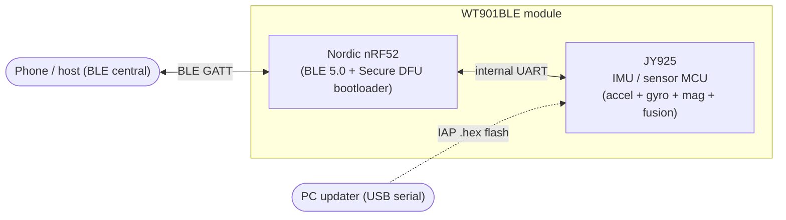

# WT901BLE — architecture, transports, power & firmware

Reference notes for the **WitMotion WT901BLE** family (tested: **WT901BLE67**, BLE 5.0).
Empirical for that firmware revision; not official vendor documentation.

## Module architecture (two chips)

The module is a **two-chip design**:



- **Nordic nRF52** — the BLE radio + GATT server + the **Nordic Secure DFU bootloader**
  (in DFU mode it advertises as **`DfuTarg`**). Appears to track the Nordic SDK
  reference design closely.
- **JY925** — the IMU/sensor MCU that produces the accel/gyro/angle/mag data and runs
  the fusion. The PC updater flashes the **JY925** over **serial IAP** (a `.hex`,
  CRC16-CCITT framed) — separate from the BLE side.
- The two talk over an **internal UART** (the JY925's serial stream is bridged to BLE).

> Some WitMotion BLE models use a **Microchip/ISSC** BLE module instead of Nordic.
> Tooling that targets the family therefore supports multiple transports (below).

## BLE transports / services

| Service | UUIDs | Role |
|---|---|---|
| **WIT data** | svc `FFE5`, notify `FFE4`, write `FFE9` | IMU data frames + register read/write (primary) |
| **Nordic UART (NUS)** | `6E40xxxx-…` | serial-over-BLE (where present) |
| **Microchip/ISSC transparent UART** | `49535343-…` | serial-over-BLE on ISSC-based modules |
| **Nordic Secure DFU** | `FE59` (buttonless) | firmware update; bootloader advertises `DfuTarg` |

- `FFE9` is **write-without-response**; a with-response write returns ATT `0x0e`.
- For **serial output / a debug console** on a Nordic unit, **NUS** is the path
  (confirm it's exposed via a GATT dump / nRF Connect); the physical **SWD/UART**
  pads on the nRF are the lower-level option (the nRF↔JY925 link is UART).

## Firmware update

- **Over BLE:** Nordic **Buttonless Secure DFU** — the app triggers DFU, the unit
  reboots into the bootloader (advertising `DfuTarg`), then a standard Nordic DFU
  package is sent.
- **Over USB (PC tool):** flashes the **JY925** `.hex` via serial **IAP**
  (CRC16-CCITT; "upgrade ready / receive / complete" handshake).
- Firmware version is in reg `0x2E` (VERSION) + the BLE Device Information Service.
  See issue #1 (firmware version / register-map differences).

## Power & sleep

- The unit **advertises continuously while powered + awake**, and **auto-sleeps on
  BLE disconnect** (and after an inactivity timeout). While asleep it **stops
  advertising** and can't be reached over BLE — wake needs **power-cycle / button**
  (motion-wake is model-dependent and did not wake the test unit).
- There is **no register that disables auto-sleep**. The only sleep control is reg
  `0x22` (SLEEP, one-shot). **To keep a unit awake indefinitely, hold a BLE
  connection open** (it sleeps only after disconnect).
- **Reg `0x25` is contested** — the standard WIT map calls it `FILTK` (dynamic
  filtering); earlier notes here called it `LOWPOWER` (auto-sleep seconds).
  Empirically, writes **≤3600 stick and >3600 are rejected** (`0` too), and the
  "65535 ⇒ ~18 h, persistent" claim could **not** be reproduced. Treat its function
  + range as **firmware-dependent and unresolved** — see issue #1.

## Data frame (`0x55 0x61`, 20 bytes, LE i16)

| Bytes | Field | Scale |
|---|---|---|
| 0–1 | header `55 61` | – |
| 2–7 | ax, ay, az | `/32768 × 16` g |
| 8–13 | wx, wy, wz | `/32768 × 2000` °/s |
| 14–19 | roll, pitch, yaw | `/32768 × 180` ° |

> The 20-byte `0x61` packet has **no temperature** field — temperature lives at
> bytes 20–21 of a longer frame, so decoders must guard on length ≥ 22 before
> reading it (reading it on a 20-byte frame overruns the buffer).

## Register write protocol

Config registers are write-locked; sequence (5-byte packets to `FFE9`):

```
FF AA 69 88 B5        # unlock  (required before ANY register write)
FF AA <reg> <lo> <hi> # write
FF AA 00 00 00        # save to flash (else RAM-only)
```

Register reads: `FF AA 27 <reg> 00` → response on `FFE4` as a `55 71` frame
(8 consecutive regs from `<reg>`, LE u16 from byte 4).
