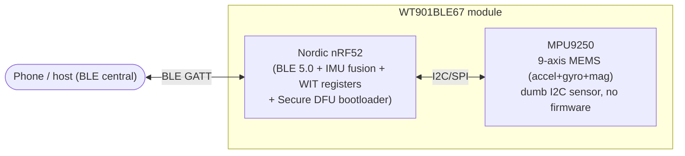

# WT901BLE — architecture, transports, power & firmware

Reference notes for the **WitMotion WT901BLE** family (tested: **WT901BLE67**, BLE 5.0).
Empirical for that firmware revision; not official vendor documentation.

## Module architecture (nRF52 + MPU9250, single-MCU)

The WT901BLE67 (BWT901BLE5.0) is effectively a **single-MCU** design:



- **Nordic nRF52** runs **everything**: the BLE radio + GATT server, reads the
  MPU9250, runs the attitude fusion, serves the **WIT register protocol**, and holds
  the **Nordic Secure DFU bootloader** (advertises **`DfuTarg`** in DFU mode).
  Tracks the Nordic SDK reference design closely — **all firmware/logic lives here.**
- **MPU9250** — a standard InvenSense 9-axis MEMS; a *dumb* sensor with no firmware.

> An earlier draft described a two-chip **nRF + JY925/STM32-IAP** design — that's a
> *different* WitMotion product line (wired/STM32 sensors flashed by the generic PC
> tool), **not** this BLE unit. Some other WitMotion BLE models use a **Microchip/
> ISSC** module instead of Nordic.

## App, SDK & firmware

**Use the right app/SDK.** This unit is the **non-CL `BWT901BLE5.0`** line. The
general WitMotion phone app (`com.wit.wit_app`) only lists the **CL** product
(`BWT901BLECL5.0`) and **will not discover/connect this device** (its scan filters
by product). Use the dedicated SDK + demo apps instead:

- **SDK (Android / iOS / Windows / Unity / Python):**
  <https://github.com/WITMOTION/WitBluetooth_BWT901BLE5_0> — all connect this unit.

**Firmware is not publicly distributed.** It's not on the WitMotion site / Download
Center, not in the PC software bundle, not in the app, and not in either SDK; the
sealed enclosure + write-only Nordic Secure DFU rule out reading it off the device.
To obtain a firmware image + changelog, **contact WitMotion support**
(support@wit-motion.com) with the model `WT901BLE67 / BWT901BLE5.0`.

## BLE transports / services

**Confirmed GATT on this unit** (live `--services` dump of WT901BLE67,
2026-06-05) — *only* the standard services + WIT data:

| Service | Characteristics | Role |
|---|---|---|
| `1800` Generic Access | `2a00` name (r/w), `2a01`, `2a04`, `2aa6` | standard GAP |
| `1801` Generic Attribute | — | standard GATT |
| **`FFE5` WIT data** | **`FFE9`** write / writeWithoutResponse · **`FFE4`** notify | IMU data frames + register read/write — **the only data path** |

- **There is NO serial/debug console:** no **NUS (`6E40…`)**, no **ISSC transparent
  UART (`49535343…`)**, no **Device-Info (`180A`)**. Those UART services are
  referenced by the multi-device app for *other* WitMotion models — **not this one.**
  The only "serial" is the `FFE4` notify stream (`0x55 0x61` frames) + `FFE9` registers.
- **No `FE59` DFU service either** → this unit is **not field-OTA-updatable** over BLE;
  firmware is factory/support-only.
- `FFE9` is **write-without-response**; a with-response write returns ATT `0x0e`.
- Physical **SWD** pads exist on the nRF but the sealed enclosure + likely `APPROTECT`
  rule out reading firmware that way.

## Firmware update

- **Over BLE (Nordic Buttonless Secure DFU):** the general design path — but **our
  unit does NOT expose the `FE59` DFU service** (confirmed GATT above), so it is **not
  field-updatable over BLE**. On units that do have it, the app triggers DFU → reboot
  to bootloader (`DfuTarg`) → signed package; Secure DFU is **write-only** (no read-back).
- The firmware **image is not obtainable** by users (see *App, SDK & firmware* above
  + issue #1) — request it from WitMotion support.
- Firmware version is in reg `0x2E` (VERSION) + the BLE Device Information Service.
- (The serial **STM32 ISP / `.hex` IAP** flow in WitMotion's PC tool is for their
  *wired/STM32* sensors — **not** this nRF-based BLE unit.)

## Power & sleep

- The unit **advertises continuously while powered + awake**, and **auto-sleeps on
  BLE disconnect** (and after an inactivity timeout). While asleep it **stops
  advertising** and can't be reached over BLE — wake needs **power-cycle / button**
  (motion-wake is model-dependent and did not wake the test unit).
- There is **no register that disables auto-sleep**. The only sleep control is reg
  `0x22` (SLEEP, one-shot). **To keep a unit awake indefinitely, hold a BLE
  connection open** (it sleeps only after disconnect).
- **Reg `0x25` is contested** — the standard WIT map calls it `FILTK` (dynamic
  filtering); earlier notes here called it `LOWPOWER` (auto-sleep seconds).
  Empirically, writes **≤3600 stick and >3600 are rejected** (`0` too), and the
  "65535 ⇒ ~18 h, persistent" claim could **not** be reproduced. Treat its function
  + range as **firmware-dependent and unresolved** — see issue #1.

## Data frame (`0x55 0x61`, 20 bytes, LE i16)

| Bytes | Field | Scale |
|---|---|---|
| 0–1 | header `55 61` | – |
| 2–7 | ax, ay, az | `/32768 × 16` g |
| 8–13 | wx, wy, wz | `/32768 × 2000` °/s |
| 14–19 | roll, pitch, yaw | `/32768 × 180` ° |

> The 20-byte `0x61` packet has **no temperature** field — temperature lives at
> bytes 20–21 of a longer frame, so decoders must guard on length ≥ 22 before
> reading it (reading it on a 20-byte frame overruns the buffer).

## Register write protocol

Config registers are write-locked; sequence (5-byte packets to `FFE9`):

```
FF AA 69 88 B5        # unlock  (required before ANY register write)
FF AA <reg> <lo> <hi> # write
FF AA 00 00 00        # save to flash (else RAM-only)
```

Register reads: `FF AA 27 <reg> 00` → response on `FFE4` as a `55 71` frame
(8 consecutive regs from `<reg>`, LE u16 from byte 4).
